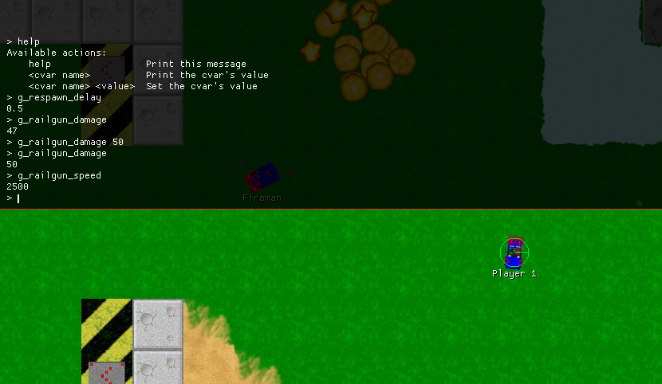

<div align="center">
    <h1>Cvars</h1>
    <i>Configuration variables .rs</i>
    <br />
    A simple and ergonomic way to store and edit configuration at runtime
</div>
<br />

[](https://crates.io/crates/cvars)
[](https://github.com/martin-t/cvars/blob/master/LICENSE)
[](https://github.com/martin-t/cvars/actions)
[](https://rustsec.org/)
[](https://deps.rs/repo/github/martin-t/cvars)
[](https://discord.gg/aA7hCFvYh9)
<!--  Disabled because it counts cvars-bench-compile-time, plus it's currently broken and always shows 0 anyway. -->

_Cvars_ (console variables or configuration variables) are a **simple** way to store settings you want to change at runtime without restarting your program.

_Consoles_ are the most **ergonomic** way to set cvars but you can write your own UI or read them from stdin if you want.

These crates are inspired by the idTech (Doom, Quake) and Source family of game engines but they can be useful outside games. Cvars allow you to iterate faster by letting you test certain gameplay changes without recompiling. They also make your game more moddable if you expose (a subset of) them to players.

**TL;DR**: Set and get struct fields based on the field's name as a string. User writes the cvar's name and new value into the console, it sets the appropriate field in your config struct and the game now behaves differently. Your gamecode uses cvars as regular staticly typed values.

<!-- To avoid keeping a large file in the repo forever, this video was uploaded to a dummy github issue. AFAIK the issue doesn't even need to be submitted and it'll still be hosted forever. -->
<a href="https://user-images.githubusercontent.com/4079823/152082630-a705286d-c630-4507-9213-b8a7b106d47e.mp4">Usage example video worth 15*1000 words per second</a>

**Zero boilerplate** - there are no traits to implement manually and no setup code to call per cvar.

**Minimal performance cost** - just struct field access instead of a hardcoded constant. Cvars are cheap enough to keep everything configurable even after you're done finding the best values - you can keep things tweakable in your released game for players to experiment themselves.

## Usage

- Add cvars to your `Cargo.toml`:

```shell
cargo add cvars
```

- Put your config in a struct and derive `SetGet`:

```rust
use cvars::SetGet;

// This struct contains all your config options.
#[derive(SetGet)]
pub struct Cvars {
    g_rocket_launcher_ammo_max: i32,
    g_rocket_launcher_damage: f32,
    // more cvars ...
}

// Here you set default values.
impl Cvars {
    pub fn new() -> Self {
        Self {
            g_rocket_launcher_ammo_max: 20,
            g_rocket_launcher_damage: 100.0,
        }
    }
}

// Store this in your game state.
let mut cvars = Cvars::new();
```

- Allow users to change the config:

```rust
// These normally come from the user
// (from stdin / your game's console / etc.)
let cvar_name = "g_rocket_launcher_damage";
let new_value = "150";

// This looks up the right field and sets it to the new value.
cvars.set_str(cvar_name, new_value).unwrap();
```

## Motivation

A player/modder/gamedev wants rockets to do more damage.
He types `g_rocket_launcher_damage 150` into the game's console or stdin.
The code gets both the cvar name and new value as strings
so you can't write `cvars.g_rocket_launcher_damage = 150`.
You need to look up the correct field based on the string - this is what `cvars` does - it generates `set_str`
(and some other useful methods). You call `cvars.set_str("g_rocket_launcher_damage", "150");`
which looks up the right field, parses the value into its type and updates the field with it.
From then on, rockets do 150 damage.

The important thing is that in the rest of your application,
you can still access your cvars as regular struct fields - e.g. `player.health -= cvars.g_rocket_launcher_damage;`.
This means you only need to use strings when the user
(player or developer when debugging or testing a different balance) is changing the values.
The rest of your **gamelogic is still statically typed** and using a cvar in gamecode
is just a field access without any overhead.

A typical game will have hundreds or thousands of tunable parameters.
With cvars and a console you can keep them all configurable for advanced players,
modders and your-gamedev-self without having a build and elaborate settings menu.
You can keep everything configurable using a TUI
while also exposing common settings to normal players in your game's GUI.

See [cvars/examples/stdin.rs](https://github.com/martin-t/cvars/blob/master/cvars/examples/stdin.rs)
for a small runnable example.

For real-world examples, look at games using cvars:

- [RecWars](https://github.com/martin-t/rec-wars/blob/master/src/cvars.rs) - uses the Macroquad console,
  every aspect of the gameplay is configurable,
  you can test it [in your browsser](https://martin-t.gitlab.io/gitlab-pages/rec-wars/macroquad.html)
- [RustCycles](https://github.com/rustcycles/rustcycles/blob/master/src/cvars.rs) - uses the Fyrox console

## [Fyrox console](https://github.com/martin-t/cvars/tree/master/cvars-console-fyrox)

[](https://crates.io/crates/cvars-console-fyrox)
[](https://github.com/martin-t/cvars/blob/master/LICENSE)
[](https://github.com/martin-t/cvars/actions)
[](https://rustsec.org/)
[](https://deps.rs/repo/github/martin-t/cvars?path=cvars-console-fyrox)
[](https://discord.gg/aA7hCFvYh9)

The Fyrox console is a separate crate in this repo. To use it in your game, add it to your `Cargo.toml` and call its methods on the relevant engine events.


See the [crates.io page](https://crates.io/crates/cvars-console-fyrox) or its [docs](https://docs.rs/cvars-console-fyrox/*/cvars_console_fyrox/) for more information.

## [Macroquad console](https://github.com/martin-t/cvars/tree/master/cvars-console-macroquad)

[](https://crates.io/crates/cvars-console-macroquad)
[](https://github.com/martin-t/cvars/blob/master/LICENSE)
[](https://github.com/martin-t/cvars/actions)
[](https://rustsec.org/)
[](https://deps.rs/repo/github/martin-t/cvars?path=cvars-console-macroquad)
[](https://discord.gg/aA7hCFvYh9)

The Macroquad console is a separate crate in this repo. To use it in your game, add it to your `Cargo.toml` and call its `update` method every frame.



See the [crates.io page](https://crates.io/crates/cvars-console-macroquad) or its [docs](https://docs.rs/cvars-console-macroquad/*/cvars_console_macroquad/) for more information.

## Features

- [x] Derive macro `SetGet` to create settters and getters for cvars based on their name
  - [x] Statically typed (`set`, `get`)
  - [x] As string (`set_str`, `get_string`)
- [x] Function like `cvars!` macro to declare type and initial value on one line
- [x] Support user-defined cvar types (both structs and enums)
- [ ] Saving and loading cvars to/from files - useful if your game has multiple balance presets
- [x] In-game console for the Fyrox engine
- [x] In-game console for the Macroquad engine
- [ ] Autocompletion

Features I am currently not planning to implement myself but would be nice to have. I might accept a PR if it's clean and maintainable but it's probably better if you implement them in your own crate:

- In-game console for the Bevy engine
- In-game console for the Egui UI toolkit
- Non-blocking stdio-based console
  - This would bring the full power of cvars to any program that can access stdin/out without the need to implement a console for every engine or UI toolkit.

## Alternatives

- [inline_tweak](https://crates.io/crates/inline_tweak)
  - Uses hashmaps - overhead on every access
  - Can't be used in some contexts (e.g. in a `const`)
  - Veloren switched to it from const-tweaker
- [const-tweaker](https://crates.io/crates/const-tweaker)
  - Web GUI
  - Only supports a few stdlib types, no custom types
  - Has soundness issues [according](https://github.com/tgolsson/tuna#alternatives) to tuna's author
  - Uses hashmaps - overhead on every access
- [tuna](https://crates.io/crates/tuna)
  - Web GUI
  - Unclear if it supports enums
  - Uses hashmaps - overhead on every access
- [cvar](https://crates.io/crates/cvar)
  - Uses a trait instead of a macro. The trait seems to need to be implemented manually so more boilerplate.
  - Has additional features (lists, actions) which `cvars` currently doesn't.

Compared to these, cvars either has no overhead at runtime or requires less setup code. The downside [currently](https://github.com/martin-t/cvars/issues/6) might be slightly increased incremental compile times (by hundreds of milliseconds).

Cvars also serves a slightly different purpose than inline_tweak and const-tweaker. It's meant to stay in code forever, even after releasing your game, to enable modding by your game's community.

## Development

The repo is organized as a cargo workspace for the main functionality, with consoles and benchmarks as separate crates - see `Cargo.toml` for the technical reasons.

- **Testing:** Use `cargo test` in the root directory to test everything in the workspace. To test the consoles, `cd` into their directories and run `cargo test` there.

- **Debugging**:
  - Use `cargo expand --package cvars-macros --example testing-fnlike` to see what the proc macros generate. There is a similar file for derive macros. You can use `println!` and `dbg!` in the macros as well.
  - The expanded code won't compile but the end of the output will contain errors that can help you track down what's wrong with the generated code: `cargo expand --package cvars-macros --example testing-fnlike > cvars-macros/examples/testing-expanded.rs && cargo build --package cvars-macros --example testing-expanded && rm cvars-macros/examples/testing-expanded.rs`

- **Benchmarking:** Run `./bench.sh` in `cvars-bench-compile-time` to benchmark incremental compile time when using the proc macros.

- **Useful commands**: [cargo-llvm-lines](https://github.com/dtolnay/cargo-llvm-lines) and [cargo-bloat](https://github.com/RazrFalcon/cargo-bloat). Use either of them in `cvars-bench-compile-time` (e.g. e.g. `cargo llvm-lines --features fnlike,cvars-1000`) to find out which functions generate a lot of LLVM IR and which compile to a lot of code. This is a good indicator of what is causing long compile times. Lines of LLVM IR is a bit more important because it better indicates how much work the backend has to do even if it compiles down to a small amount of machine code.

## Contributing

You can always find me on the [Rusty Games Discord server](https://discord.gg/aA7hCFvYh9) if you have any questions or suggestions.

[Issues](https://github.com/martin-t/cvars/issues/new) and [Pull Requests](https://github.com/martin-t/cvars/pulls) are welcome. See the [good first issue](https://github.com/martin-t/cvars/issues?q=is%3Aissue+is%3Aopen+label%3A%22good+first+issue%22) label for easy tasks.

## License

[AGPL-v3](LICENSE) or newer
